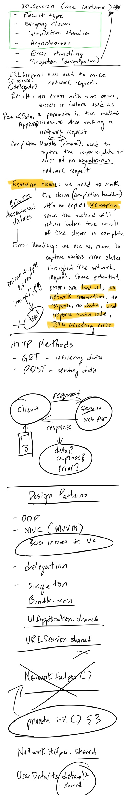

# NetworkHelper

Today we built a wrapper class around URLSession. The NetworkHelper wrapper class returns a Data object given a url String. This String can be an image url string or and API endpoint url String or any given GET url. With this Data returned from the NetworkHelper e.g an image can be created or a Swift model e.g Podcast can be created.

#### NetworkHelper class
[NetworkHelper class](https://github.com/alexpaul/NetworkHelper/blob/master/NetworkHelper/NetworkHelper.swift)   

#### Using the Apple Search API and making use of the NetworkHelper to GET podcasts   
[PodcastAPIClient](https://github.com/alexpaul/NetworkHelper/blob/master/NetworkHelper/PodcastAPIClient.swift) 

#### In-class Notes 

 
  
Notes
 
  
  
  

 
